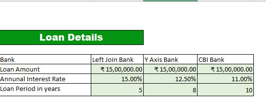
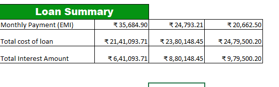

## codebasics assignment 3
Mr. Hathodawala has loan offers from three banks and he has assigned task to me suggesting him key insights which offer should he choose

Here I created the loan summary which provides following insights

Brief Summary:

- Left join bank has the highest interest rate (15%), but because the loan repayment is 5 years, the total interest is lowest 6.41 Lakh rupees.

- CBI Bank has lowesr interest rate (11%) but its 10 years tenure results in highest total interest: 9.80 Lakh rupees.

### Tenure has a major impact on total interest.
- CBI loan saves Mr.Hathodwala EMI about 15,022 per month compared to - Left join bank, but he has to pay 3.38 Lakh rupees more in total interest.

- Y axis Bank sits between the two options:
- EMI is about ₹10,891 lower than Left join Bank.
- Total interest is about ₹2.39 lakh higher than Left join Bank.
- Its 8-year tenure provides a middle ground between EMI and interest cost.

- If your priority is low monthly cash flow, the longer tenure loans have lower EMIs.

- If your priority is minimizing the total amount paid, the 5-year loan has the lowest total cost among these three.

- **A higher interest rate with a shorter tenure can result in lower total interest, but it requires a monthly EMI**.

**check report** [loan report](Loan_repayment_solution.pdf)
#### As per Mr. Hathodawla monthly budget for loan repayment is ₹25000.

Left Join Bank: EMI exceeds the budget, so the 5-year repayment plan doesn't fit the ₹25,000 monthly limit.

Y Axis Bank: EMI is almost exactly within the budget, leaving only about ₹207/month.

CBI Bank: EMI is comfortably within the budget, leaving about ₹4,338/month.

So, based only on the ₹25,000 monthly repayment constraint, the 5-year loan doesn't fit, while the 8-year and 10-year options do.
