# Assignment 4: 📊 Power Query Data Cleaning & Transformation

## Codebasics Assignment:

[](https://codebasics.io/courses/bootcamp/1/excel-mother-of-business-intelligence/lecture/1200)

## 📌 Project Overview

This project focuses on using **Microsoft Excel Power Query** to clean, transform, and combine hotel booking data.

The objective was to take raw CSV files, identify data-quality issues, perform the required transformations, and prepare the data for further analysis.

## 🛠️ Tools Used

* Microsoft Excel
* Power Query
* CSV files

## 📂 Dataset

The project uses two CSV files:

* `bookings_data.csv`
* `rooms_data.csv`

The tables contain hotel booking and room-related information.

## 🔄 Data Cleaning & Transformation Steps

### 1. Load the CSV Files

Created a new Excel workbook and imported both CSV files using:

**Data → From Text/CSV**

The files were then opened in **Power Query Editor** for cleaning and transformation.
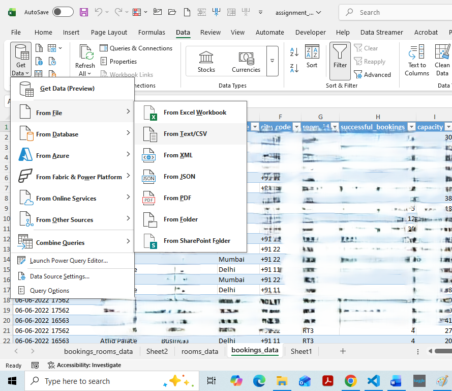
### 2. Change `property_id` Data Type

Changed the data type of the `property_id` column from its original format to **Text**.

This ensures that property IDs are treated as identifiers rather than numerical values.
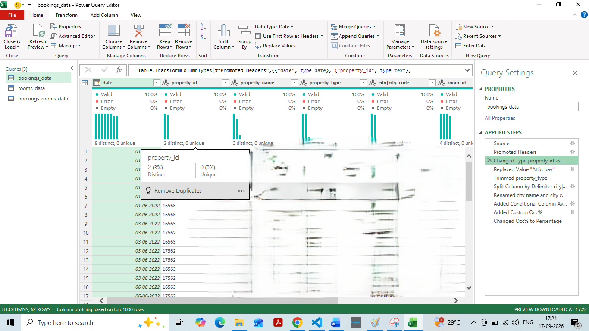

### 3. Standardize `property_name`

Some values in the `property_name` column were written as:

`Atliq bay`
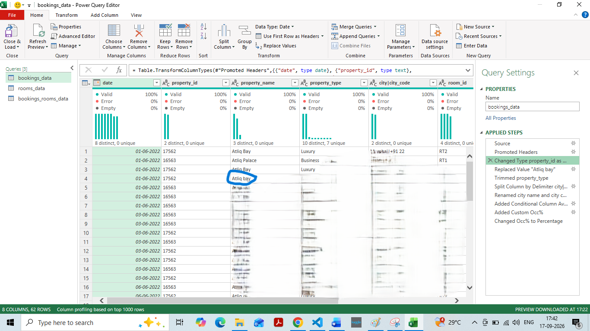
These were replaced with:

`Atliq Bay`

This standardized the property name.
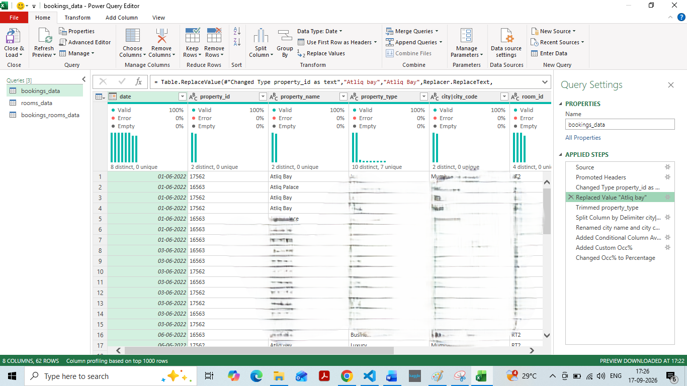

### 4. Remove Extra Spaces from `property_type`

Cleaned the `property_type` column by removing unnecessary leading and trailing spaces.

This helps maintain consistent text values during analysis.
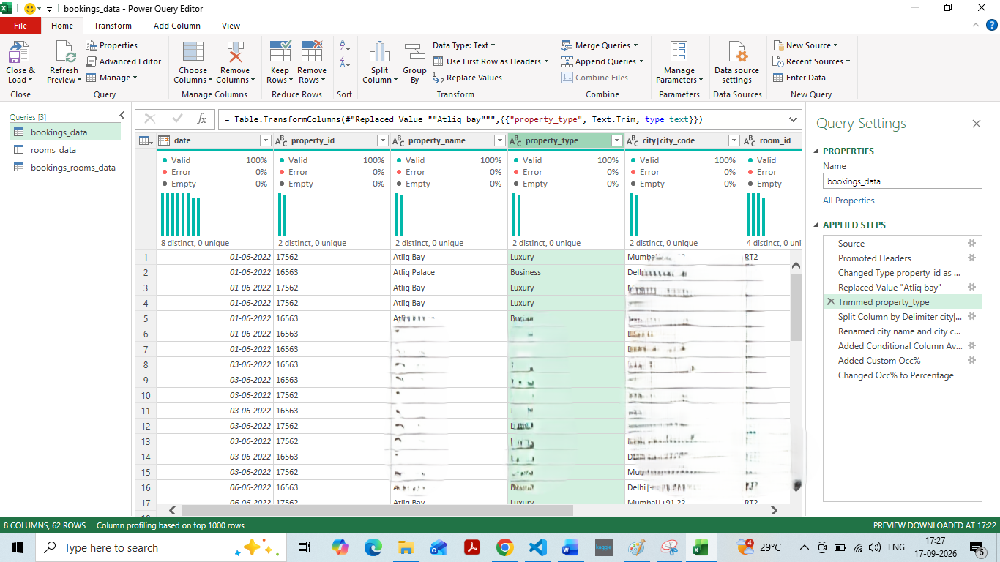 
### 5. Split `city|city_code`

The `city|city_code` column contained two pieces of information separated by the `|` delimiter.

Example:

`Mumbai|MUM`

The column was split using the `|` delimiter into two separate columns:
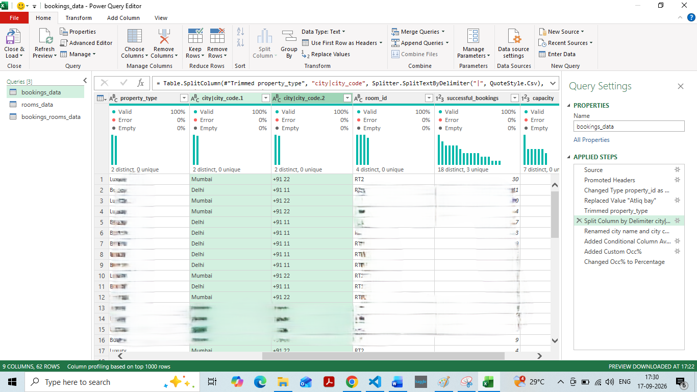
* `city`
* `city_code`

The resulting columns were renamed accordingly.
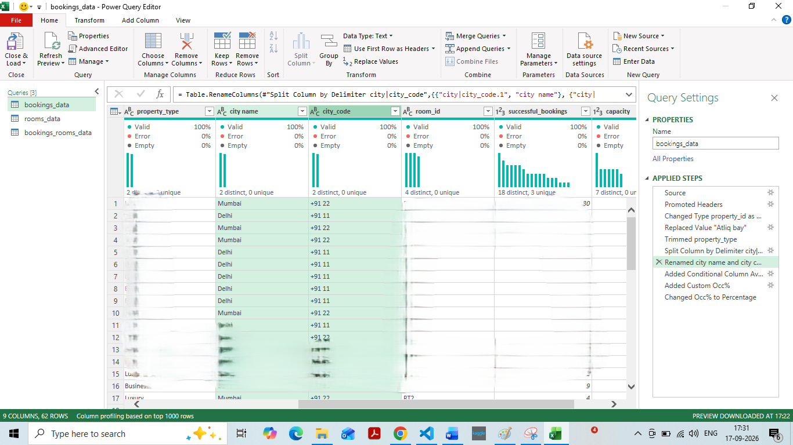
### 6. Create `Availability Status`

Created a conditional column named:

`Availability Status`
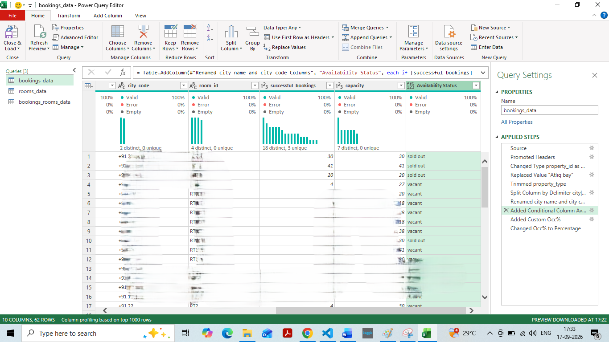
The logic was:

```text
If successful_bookings = capacity
    → "sold out"

Otherwise
    → "vacant"
```

This creates a simple business-friendly classification of room availability.

### 7. Create `occ%`

Created a custom column called:

`occ%`

The calculation was:

```text
successful_bookings / capacity
```

The resulting column was then converted to **Percentage** data type.

This represents the occupancy percentage.
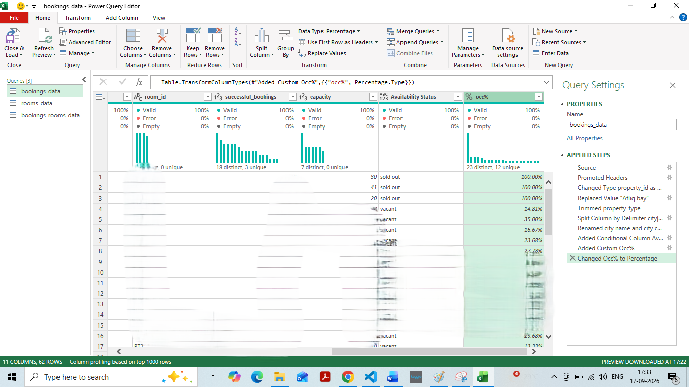

### 8. Merge `bookings_data` and `rooms_data`

Merged the two tables using:

`room_id`

The `room_class` column from `rooms_data` was added to `bookings_data`.

The columns were then reordered so that `room_class` appears next to `room_id`.

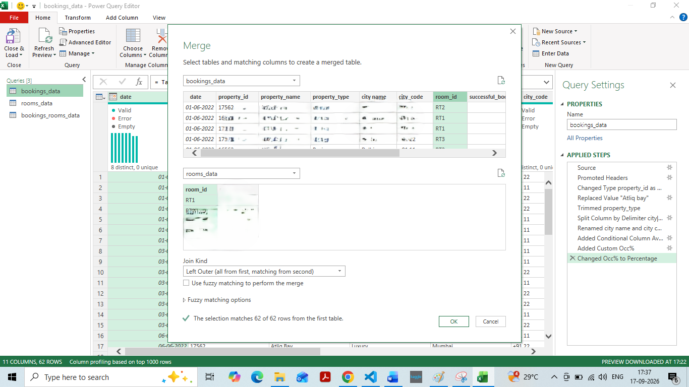

expand room class

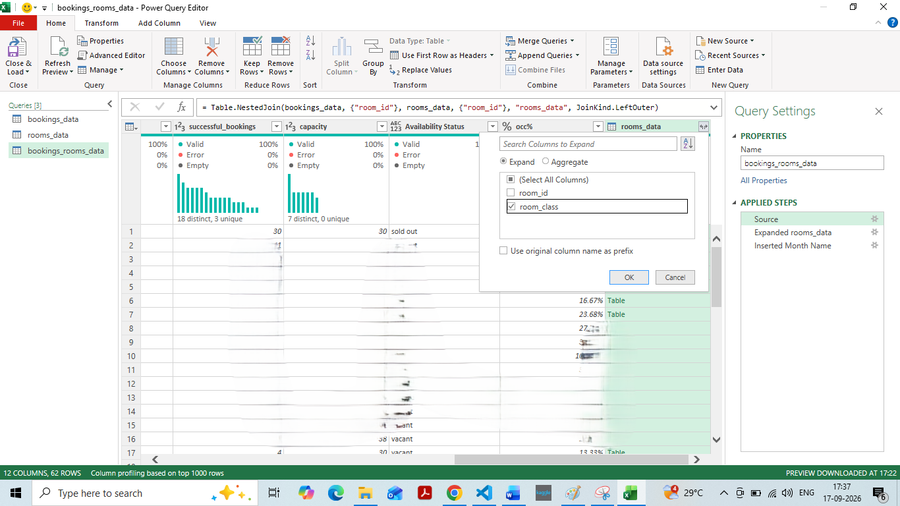
### 9. Extract Month Name

Extracted the **month name** from the `date` column.

This creates a useful time-based field that can later be used for monthly analysis and reporting.

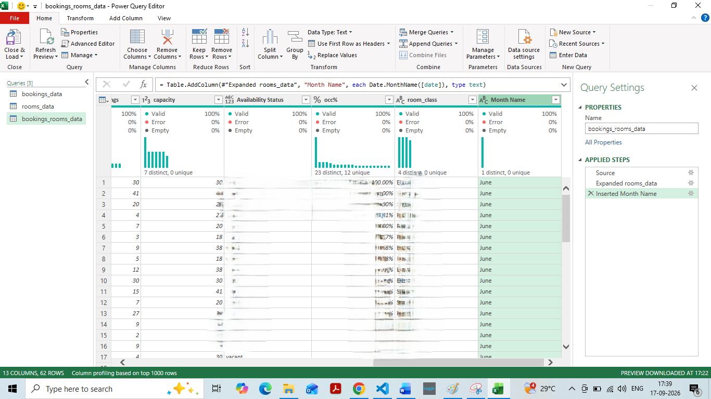
## 💡 Key Learning

Through this project, I practiced how Power Query can be used to:

* Clean inconsistent data
* Standardize text values
* Change data types
* Split columns
* Create conditional columns
* Create custom calculations
* Merge datasets
* Extract useful information from dates
* Prepare data for further analysis

## 🎯 Conclusion

This exercise helped me understand that Power Query is not only about cleaning individual columns. It can also be used to **transform, combine, and prepare data in a repeatable workflow before analysis**.
