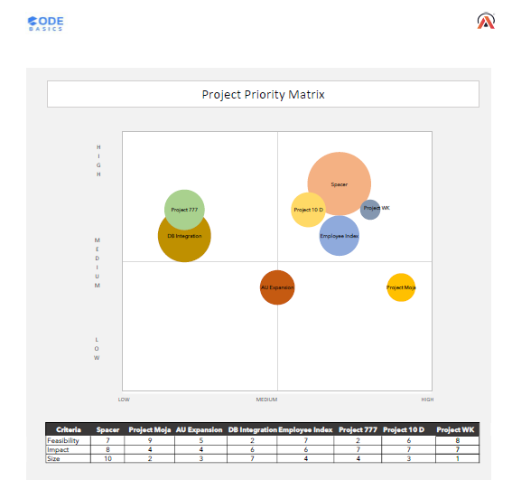

# Project Priority Matrix

## Project Overview

When a Project Manager is handling multiple projects at the same time, deciding which project to work on first can become challenging.

This project presents a simple **Project Priority Matrix** designed around a business scenario at **AtliQ**, where Wanda, a Project Manager, is managing multiple projects and needs a structured way to compare them.

The matrix evaluates projects based on three key dimensions:

* **Feasibility** — How easy or practical the project is to implement.
* **Impact** — How much potential business value the project can create.
* **Size** — The relative scale of the project based on resources, cost, time, or effort required.

The objective is not to automatically select a project, but to provide a visual framework that can support project prioritization and discussion.

---

## Business Problem

Wanda has multiple projects in her portfolio and limited resources available to execute them.

Without a structured comparison, it can be difficult to understand:

* Which projects could create significant business impact?
* Which projects are relatively easy to implement?
* Which projects may require significant resources?
* Which projects should be evaluated more carefully?

To address this, I created a **Project Priority Matrix using a Bubble Chart**.

---

## Project Objective

The objective was to create an interactive and easy-to-understand visualization that allows project teams to compare projects using:

**Feasibility + Impact + Project Size**

---

## Project Priority Matrix

The matrix uses three dimensions:

| Component   | Representation | Meaning                                   |
| ----------- | -------------- | ----------------------------------------- |
| Feasibility | X-axis         | How easy the project is to implement      |
| Impact      | Y-axis         | Potential business impact                 |
| Size        | Bubble size    | Relative resources, cost, time, or effort |

### Matrix Structure

```text
                 HIGH IMPACT
                      ↑
                      |
       High Impact    |    High Impact
       Low Feasibility|    High Feasibility
                      |
----------------------+--------------------→ FEASIBILITY
                      |
       Low Impact     |    Low Impact
       Low Feasibility|    High Feasibility
                      |
                 LOW IMPACT
```

---

## How to Interpret the Matrix

### 1. High Impact + High Feasibility

Projects in the **upper-right area** have both high potential impact and high feasibility.

These projects can be considered strong candidates for further evaluation and prioritization.

### 2. High Impact + Low Feasibility

These projects could create significant value but may require more time, resources, cost, or effort.

They may require additional planning before implementation.

### 3. Low Impact + High Feasibility

These projects are relatively easy to implement but may provide comparatively lower business impact.

They could be considered as quick or secondary initiatives depending on available resources.

### 4. Low Impact + Low Feasibility

Projects in the **bottom-left area** have relatively low impact and low feasibility.

They may require lower priority compared with projects that provide greater value or are easier to execute.

---

## Bubble Size

The bubble size represents the relative **size of the project**.

Depending on the business context, this could represent:

* Cost
* Number of resources required
* Time required
* Implementation effort
* Overall project scale

A larger bubble does not automatically mean higher priority. It simply indicates that the project is relatively larger in scale.

---

## Data Preparation

The project uses a manually maintained input table containing project-level information.

Example:

| Project   | Feasibility | Impact | Size |
| --------- | ----------: | -----: | ---: |
| Project A |           8 |      9 |    5 |
| Project B |           5 |     10 |    8 |
| Project C |           9 |      5 |    3 |
| Project D |           3 |      4 |   10 |
| Project E |           7 |      8 |    4 |

The values can be updated as new information becomes available.

This makes the matrix flexible for project teams because they can change the input values and update the visualization.

---

### Key Insights

The Project Priority Matrix provides a visual comparison of the projects based on feasibility, impact, and project size.

Some observations from the analysis:

- **Project WK** has high feasibility (8), high impact (7), and the smallest project size (1), placing it in the high-feasibility/high-impact area with relatively low project size.
- **Spacer** has high feasibility (7) and high impact (8), but it also has the largest project size (10), indicating a potentially high-value project that may require significant resources.
- **Project 10D** has relatively high feasibility (6) and impact (7), with a smaller project size of 3.
- **Project 777** has high impact (7) but low feasibility (2), indicating that implementation may be more challenging despite its potential impact.
- **DB Integration** has low feasibility (2), moderate impact (6), and a relatively large size (7).
- **Project Moa** has the highest feasibility (9) but comparatively lower impact (4).

The matrix helps provide a structured view of these trade-offs rather than looking at each project independently.
---

## Business Value

The main purpose of this matrix is to support **structured project discussions**.

Instead of looking at projects individually, a Project Manager can view the entire project portfolio in one place and discuss:

**"Which projects provide the greatest potential value relative to their feasibility and required resources?"**

The matrix acts as a decision-support tool rather than making the final decision automatically.

---

## Tools & Techniques

* Microsoft Excel
* Data preparation
* Basic data analysis
* Bubble Chart
* Business analysis
* Data visualization
* Decision-support visualization

---

## Project Workflow

```text
Project Information
        ↓
Manual Input Table
        ↓
Feasibility / Impact / Size
        ↓
Data Preparation
        ↓
Bubble Chart
        ↓
Project Priority Matrix
        ↓
Business Insights
```

---

## Project Screenshot:




## Key Learning

This project helped me understand that data visualization is not only about creating charts.

A useful visualization should help answer a **business question**.

In this case, the Bubble Chart combines three different project dimensions into a single visual that can help a Project Manager compare projects and have a more structured discussion around prioritization.

---

## Author

**Galib Mulani**

Aspiring Data Analyst

LinkedIn: [Galib Mulani](https://www.linkedin.com/in/galib-mulani-5005aa184/)